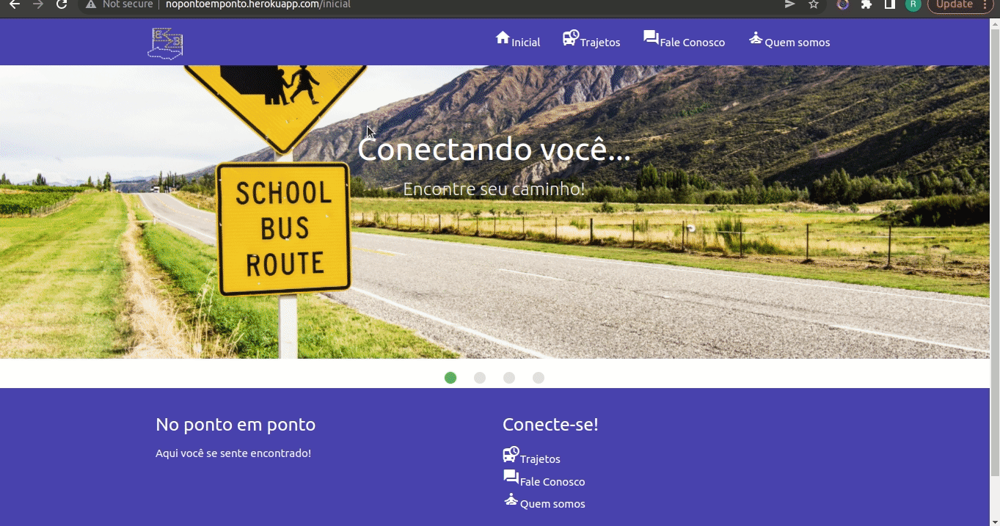

# Projeto Integrador I e II
# Título: No ponto em ponto
# Curso: Engenharia da Computação - Univesp

O usuário entra com bairro desejado e identifica os possíveis pontos.

:heavy_check_mark: Ferramentas e tecnologias utilizadas no Projeto I

* Web framework Django 3.2  
* Materialize 1.0 
* SQLITE
* Python 3.8
* HTML
* CSS
* Javascript
* Microsoft Visual Studio Code
* DbBrowser para acesso à base de dados 
* Heroku para hospedagem
 
## Integrantes do projeto I

* :woman: Camila Cunha Scorsato (requisitos, redação)
* :man: Flávio de Matos Henrique (redação)
* :man: Flávio Lacerda de Jesus (redação)
* :man: Guilherme Souza Peraro (desenvolvimento solução inicial, redação)
* :woman: Júlia Ribeiro Marques(requisitos, redação)
* :man: Lair Pereira de Souza (redação)
* :man: Rafael Ponte Cassemiro (desenvolvimento , redação, levantamento de tecnologias para o protótipo)
---
* Todos contribuíram através de tele reuniões e brainstorms para a geração de ideias, depois a seleção da ideia a se trabalhar.
* Todos participaram do vídeo de apresentação.

## Vídeo de Apresentação do Projeto I
* https://www.youtube.com/watch?v=TkZ9cziYRDU

## Integrantes do projeto II

* :man: Bruno
* :woman: Camila Cunha Scorsato (redação)
* :man: Flávio de Matos Henrique (redação)
* :man: Flávio Lacerda de Jesus (redação)
* :man: Guilherme Souza Peraro (redação)
* :woman: Júlia Ribeiro Marques (redação)
* :man: Rafael Ponte Cassemiro (evolução, testes)
* :man: Rodrigo

## Resumo Projeto

* Este trabalho consiste em propor uma solução para transporte público escolar no município de Orlândia/SP, tendo em vista que os estudantes, na busca por seus respectivos pontos de embarque para suas devidas escolas, não conseguem ter esta informação de maneira facilitada, com possíveis prejuízos à frequência nas aulas. Como o direito à educação é dever do estado e frente a esta dificuldade de acesso à informação, foi decido criar um projeto com
base em banco de dados em web chamado “NO PONTO EM PONTO”, exatamente para auxiliar os estudantes com relação a localização dos pontos de ônibus escolares, os horários e
itinerário da rota deste serviço.

## :hammer: Funcionalidades do Projeto

- `Funcionalidade`: indicar pontos de ônibus.

## Projeto I

## Projeto II

## :new: Projeto II
* Acessibiliadade (letras aumentam e diminuem)
* Usabilidade (barra de navegação fixa)
* Classe de testes (teste funcional)

# :arrow_forward: Execução do Projeto

* Acessar  o endereço:  http://nopontoemponto.herokuapp.com/ 

